# VARSeeker User Manual

## 1. What is VARSeeker?

**VARSeeker** is an open-source, dynamic, and disease-aware platform for genetic variant interpretation and management. Beyond providing rapid ACMG automated classification, it supports fine-grained evidence curation, longitudinal case tracking, and community knowledge sharing, serving diverse users from researchers to clinicians.

## 2. Quick Start

Get your first variant interpretation in 3 simple steps!

### Step 1: Enter a Variant

On the homepage, enter your variant in the input box. VARSeeker supports three input formats:

| Format Type | Example | Description |
|-------------|---------|-------------|
| **HGVS Format** (Transcript-based) | `NM_001613.4:c.535C>T` | Standard HGVS nomenclature with transcript ID |
| **Gene-based HGVS Format** | `ACTA2:c.535C>T` | HGVS nomenclature with gene symbol |
| **Genomic Coordinate Format** | `10-88941310-G-A` | VCF-style: chr-position-ref-alt |

### Step 2: Configure Options (Optional)

- **Genome Build**: Select `hg19` or `hg38` (default: hg38)

- **Phenotype**: Enter patient phenotypes for disease-aware interpretation

    - Multiple phenotypes can be entered
    - If left empty, VARSeeker automatically matches the most relevant disease

### Step 3: Click "Interpret"

Click the **"Interpret"** button to start the analysis.

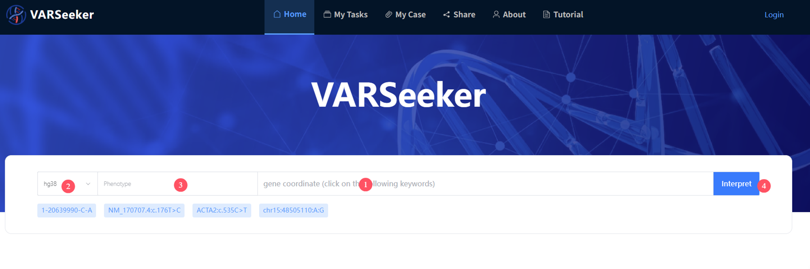

!!! tip "Pro Tip"
    Adding phenotype information significantly improves interpretation accuracy by enabling disease-specific scoring rules.

---

## 3. Single Variant Interpretation

### 3.1 Input Options

VARSeeker's homepage provides an intuitive interface for single variant interpretation:

1. **Variant Input Box**: Enter your variant in any of the three supported formats
2. **Genome Build Selector**: Choose between hg19 and hg38 coordinate systems
3. **Phenotype Field**: Enter HPO terms for phenotype-aware interpretation

### 3.2 Phenotype-Based Prioritization

One of VARSeeker's unique features is its **disease-aware interpretation**:

- When phenotypes are provided, VARSeeker applies phenotype-specific scoring rules
- The system prioritizes genes and variants associated with the input phenotypes
- Non-coding variant rules are also adjusted based on disease context

---
## 4. Batch Variant Interpretation

For large-scale variant screening in clinical or research settings, VARSeeker provides three batch interpretation methods.

### 4.1 Multiple Variants Input

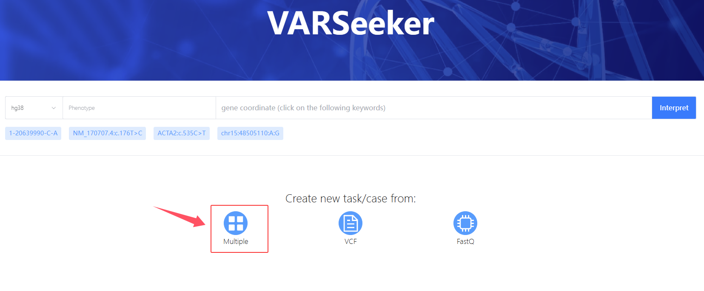

1. Click the **"Multiple"** icon below the homepage input area

2. Fill in:

    - **Task Description**: A brief description of your analysis
    - **Case Information**: Optional case details
    - **Phenotypes**: Enter HPO terms for phenotype-aware interpretation
    - **Variants**: Enter multiple variants (one per line)

3. Click **"OK"** to submit

<!-- 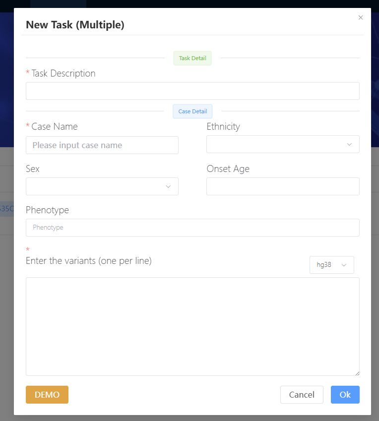 -->

   

 

### 4.2 VCF File Upload

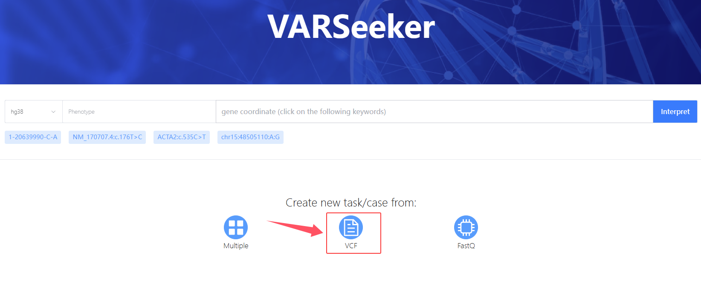

1. Click the **"VCF"** icon below the homepage

2. Fill in:

    - **Task Description**: A brief description of your analysis
    - **Case Information**: Optional case details
    - **Phenotypes**: Enter HPO terms for phenotype-aware interpretation

3. Upload your VCF file and PED format file (*optional*)

4. Click **"OK"** to submit

<!-- 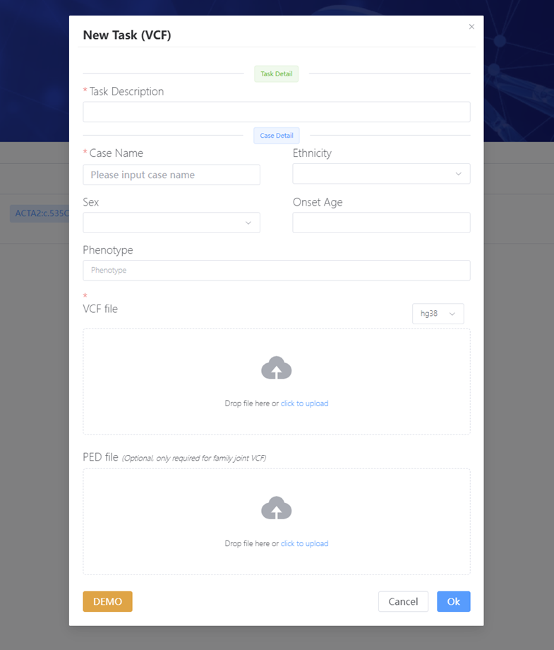 -->

   

 

### 4.3 FastQ File Upload

For end-to-end analysis from raw sequencing data:

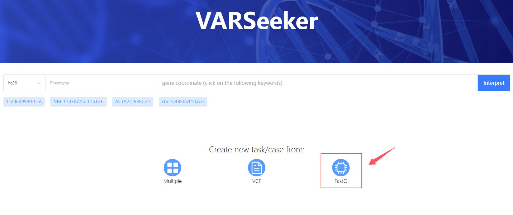

1. Click the **"FastQ"** icon below the homepage

2. Fill in:

    - **Task Description**: A brief description of your analysis
    - **Case Information**: Optional case details
    - **Phenotypes**: Enter HPO terms for phenotype-aware interpretation

3. Upload your FastQ files

4. Click **"OK"** to submit

<!-- 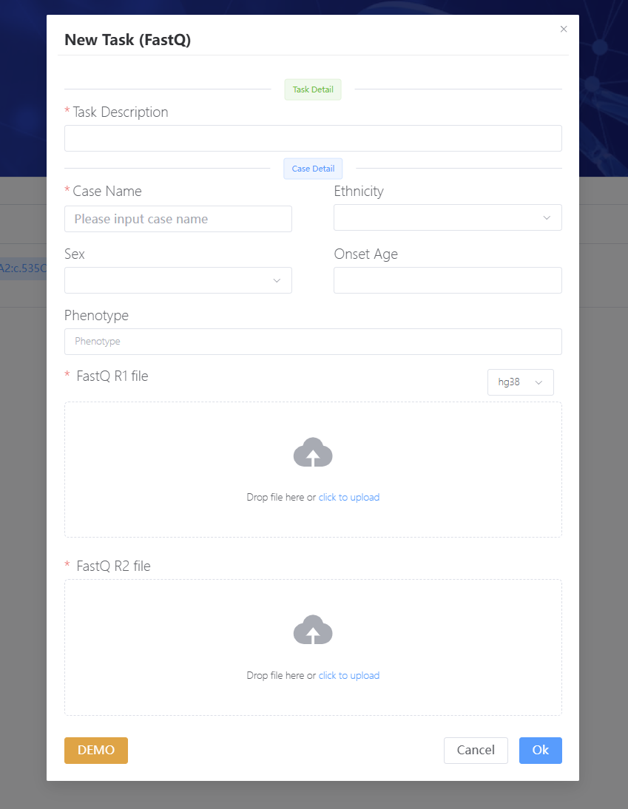 -->

   

 
<!-- > **⚡ Note**: FastQ interpretation includes variant calling pipeline and takes longer. -->

!!! danger "Note"
    FastQ interpretation includes variant calling pipeline and takes longer.

### 4.4 Accessing Batch Results

#### 4.4.1 Non-logged Users

<!-- 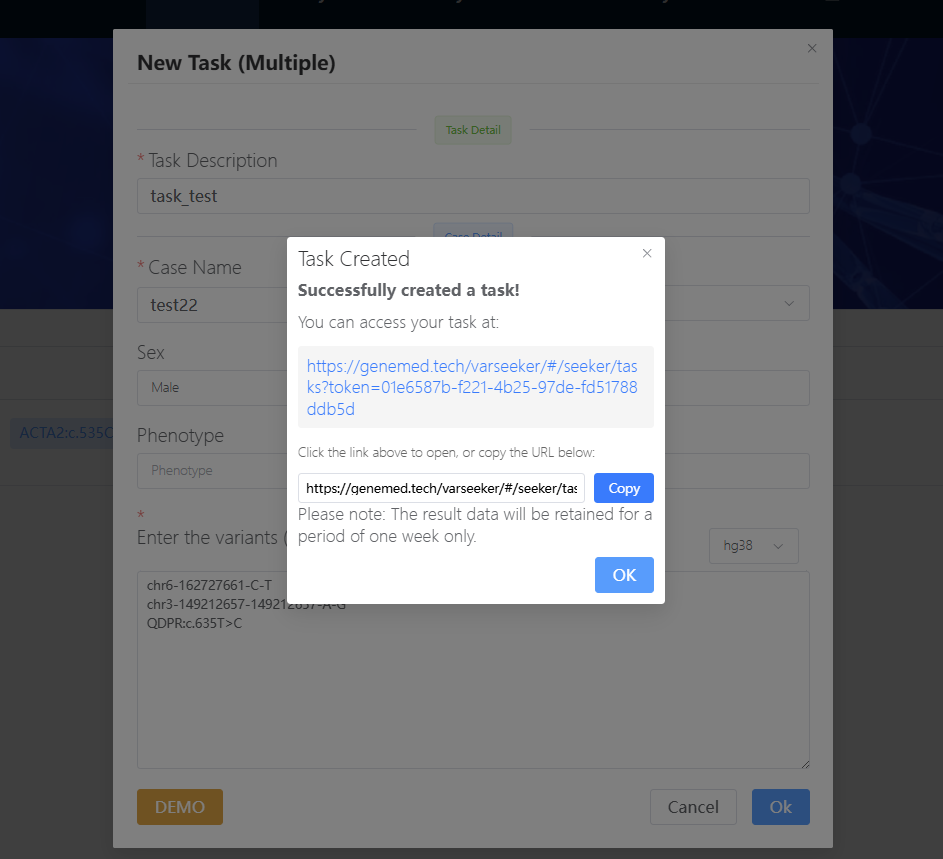 -->

   

 

After submitting batch tasks, system generates a unique **Token**:

- Save the Token link
- Access task results via the link
- Protects your data privacy

<!-- > **🔒 Privacy Protection**: Token link is known only to you—keep it secure. -->

!!! info "Privacy Protection 🔒"

    Token link is known only to you—keep it secure.

#### 4.4.2 Logged Users

Click **"My Tasks"** in navigation to directly view and manage all tasks.

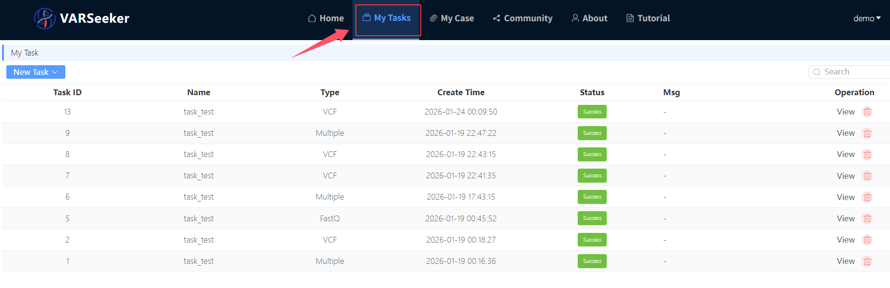

---
## 5. Understanding Interpretation Results

After interpretation completes, you'll see a result page divided into two main functional areas:

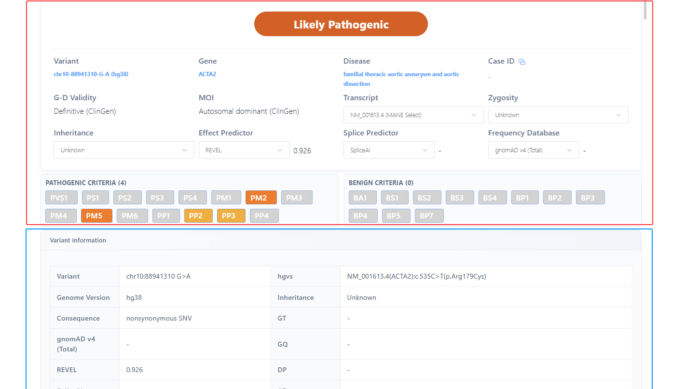

### 5.1 Overview Panel (Red Border Area)

The **Overview Panel** is positioned at the top of the page, providing a quick summary of interpretation results. It serves as both an information display and a **navigation hub** to the **Details Explorer** below.

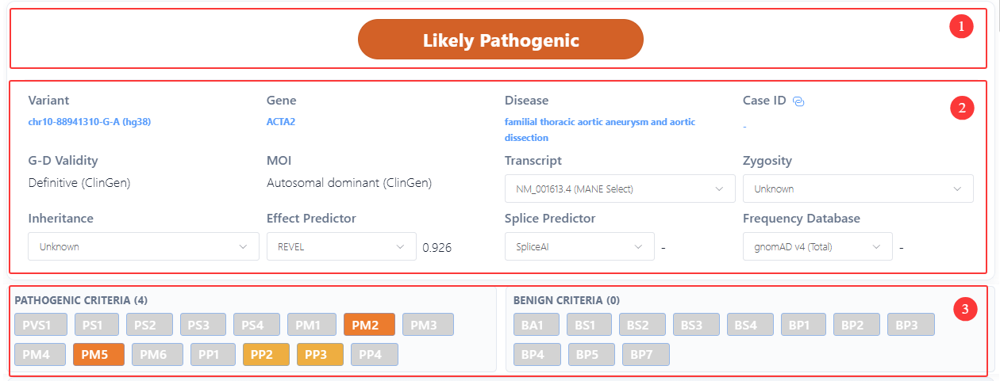

The **Overview Panel** consists of three components:

<!-- #### Region 1️⃣: Pathogenicity Classification -->

**1️⃣ Pathogenicity Classification**

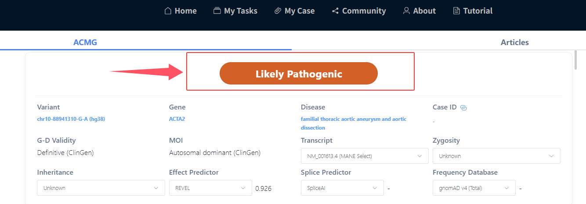

Shows final classification (ACMG/AMP guideline-compliant):

- **Pathogenic** (P)
- **Likely Pathogenic** (LP)
- **Uncertain Significance** (VUS)
- **Likely Benign** (LB)
- **Benign** (B)

<!-- #### Region 2️⃣: Basic Information -->

**2️⃣ Basic Information**

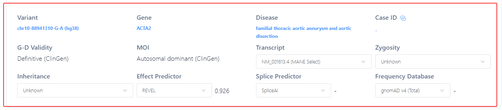

Contains key variant metadata:

- **Variant identifier**
- **Gene**
- **Associated disease**
- **Gene-disease validity**
- **Mode of Inheritance** (MOI)
- **Linked Case ID** (if set)

<!-- > **💡Quick Navigation Tip**: Click any blue hyperlinked element to auto-scroll to corresponding detailed information. -->

!!! tip "Quick Navigation Tip"
    
    Click any blue hyperlinked element to auto-scroll to corresponding detailed information.

<!-- #### Region 3️⃣: ACMG Criteria Activation Status -->

**3️⃣ ACMG Criteria Activation Status**

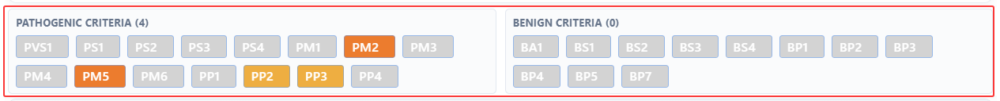

Divided into two sub-panels:

**A. Pathogenic Criteria**

- Activated criteria displayed in color (PVS1/PS1/PM1/PP1)
- Gray indicates not activated

**B. Benign Criteria**

- Activated criteria displayed in color (BA/BS/BP)
- Gray indicates not activated

<!-- >**💡Tip**: Click any criterion name to auto-scroll to its detailed evidence card. -->

!!! tip 

    Click any criterion name to auto-scroll to its detailed evidence card.

### 5.2 Details Explorer (Blue Border Area)

The **Details Explorer** is positioned below the **Overview Panel**, containing detailed information cards arranged vertically. Each card provides comprehensive details about a specific aspect of the interpretation.

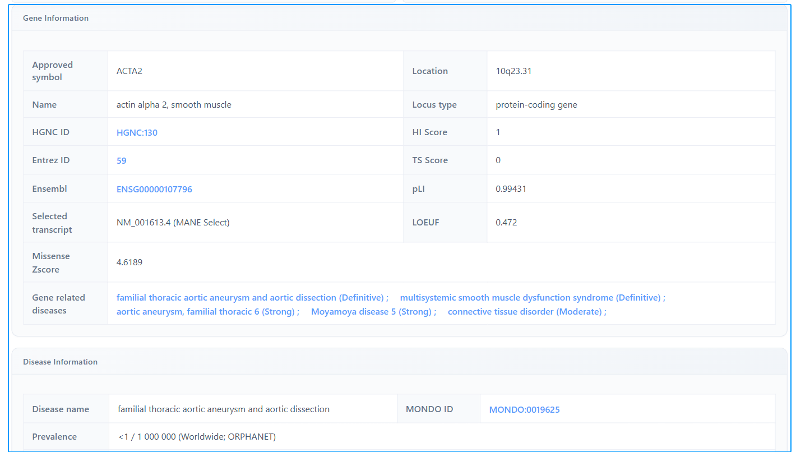

<!-- > **💡 Navigation Tip - Important!**
> 
> While you *can* scroll through the Evidence Explorer manually, **we recommend using the Overview Panel as your navigation hub**:
> 
> - **Click "Gene"** in Basic Information → Auto-scrolls to Gene detail card
> - **Click "Variant Name"** → Auto-scrolls to Variant detail card
> - **Click "Associated Disease"** → Auto-scrolls to Disease detail card
> - **Click "Linked Case"** → Auto-scrolls to Case detail card
> - **Click any criterion** (e.g., PM2, PP3) → Auto-scrolls to that criterion's detail card
> 
> This design allows you to quickly navigate to specific information without losing context in the Overview Panel. -->

!!! tip "Navigation Tip"

    While you *can* scroll through the Details Explorer manually, **we recommend using the Overview Panel as your navigation hub**:

    - **Click "Gene"** in Basic Information → Auto-scrolls to Gene detail card
    - **Click "Variant Name"** → Auto-scrolls to Variant detail card
    - **Click "Associated Disease"** → Auto-scrolls to Disease detail card
    - **Click "Linked Case"** → Auto-scrolls to Case detail card
    - **Click any criterion** (e.g., PM2, PP3) → Auto-scrolls to that criterion's detail card

    This design allows you to quickly navigate to specific information without losing context in the Overview Panel.

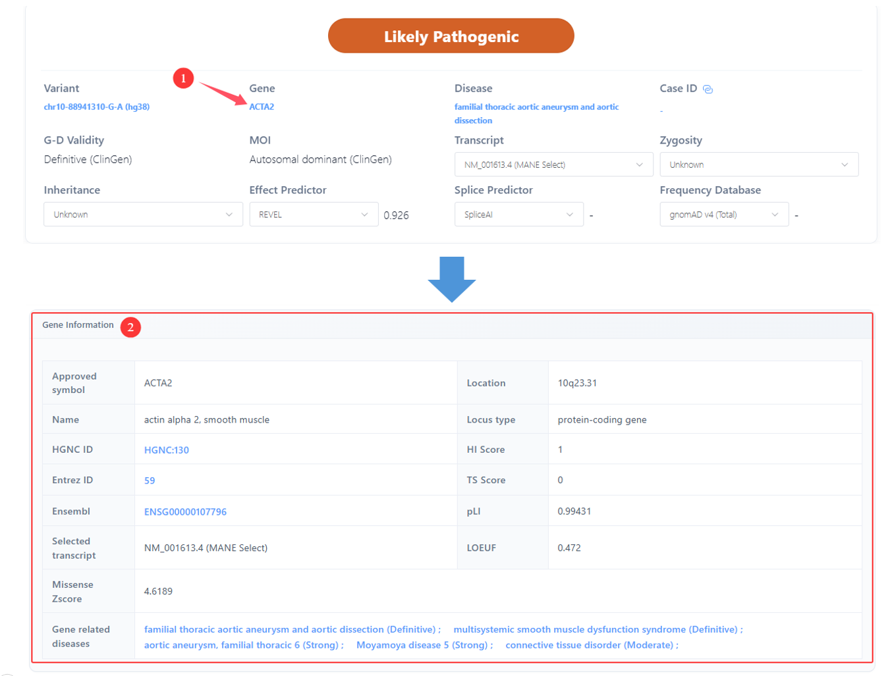

### 5.3 Criterion Detail Card Structure

Each criterion in the Details Explorer follows a consistent card structure:

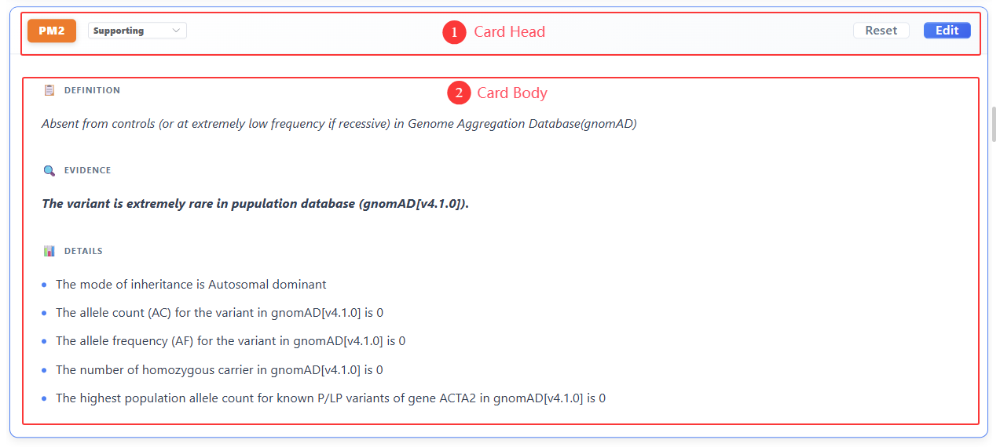

#### Card Head

- **Criterion Name & Strength**: e.g., "PM2 - Supporting"
- **Action Buttons**: Edit, Reset

#### Card Body

Contains three sections providing progressive detail:

| Section        | Purpose                                                |
| -------------- | ------------------------------------------------------ |
| **DEFINITION** | Explains what this criterion means per ACMG guidelines |
| **EVIDENCE**   | Summarizes the actual evidence status                  |
| **DETAILS**    | Lists all data points used for criterion evaluation    |

---

## 6. Fine-Grained Evidence Curation

<!-- **⭐ Key Feature**

Unlike other tools that provide static, one-time classifications, VARSeeker empowers users to **interactively curate evidence** without requiring deep ACMG guideline expertise. -->

!!! success "Key Feature ⭐ "

    Unlike other tools that provide static, one-time classifications, VARSeeker empowers users to **interactively curate evidence** without requiring deep ACMG guideline expertise.

### 6.1 Adjusting Evidence Strength

**Quick Method:**

- Use the **strength dropdown** next to each criterion name to change its strength (e.g., PP1 → PP1_Strong)

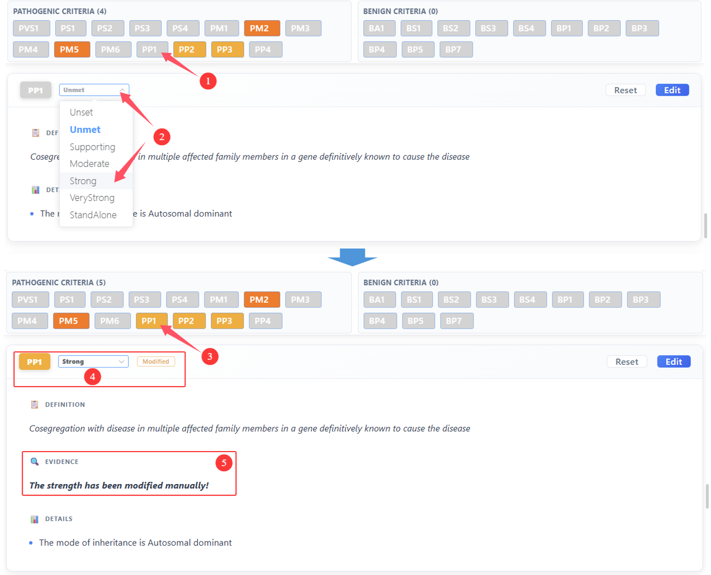

### 6.2 Detailed Evidence Editing

**Advanced Method:**

1. Click the **"Edit"** button on the criterion card
2. Answer intuitive prompts based on your data (*publications* or *in house study*)
3. VARSeeker automatically calculates the appropriate strength

#### Example: PP1 (Co-segregation) Editing

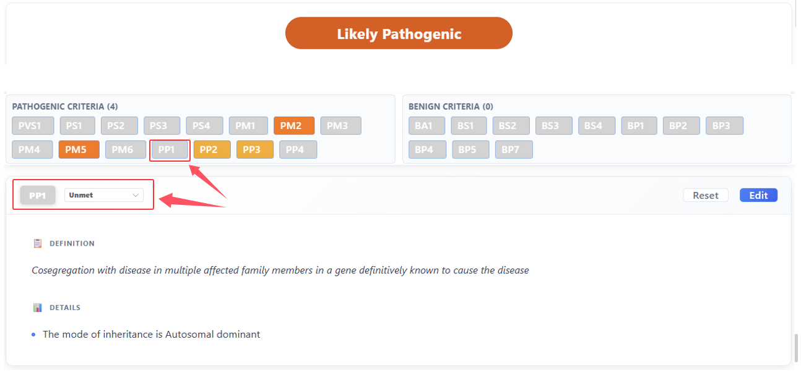

Instead of calculating LOD scores manually, simply provide:

- ✅ Whether co-segregation was observed
- ✅ Number of affected individuals in the family
- ✅ Number of unaffected individuals in the family

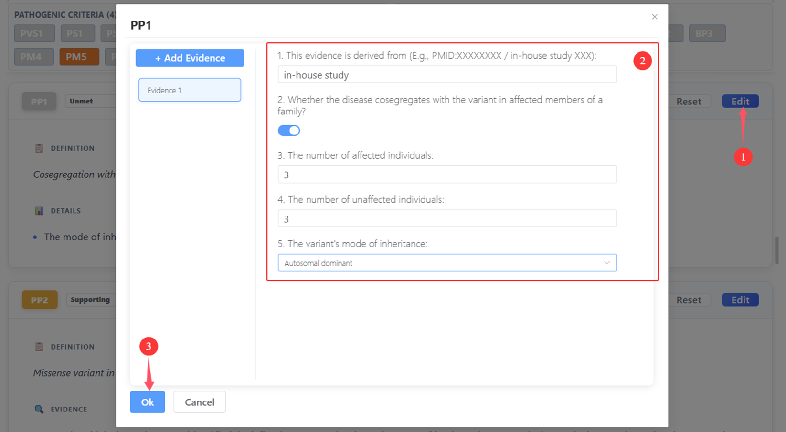

VARSeeker automatically determines the evidence strength!

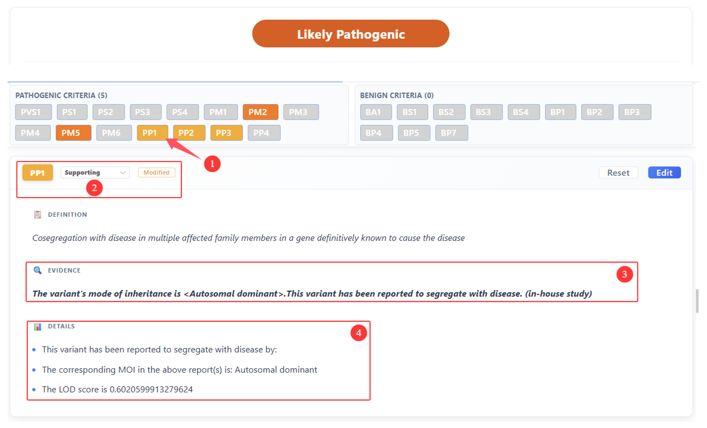

### 6.3 Tracking Modifications 

- **Modified Badge**: A "Modified" label appears next to manually adjusted criteria
- **Reset Option**: Click **"Reset"** to restore the original system assessment

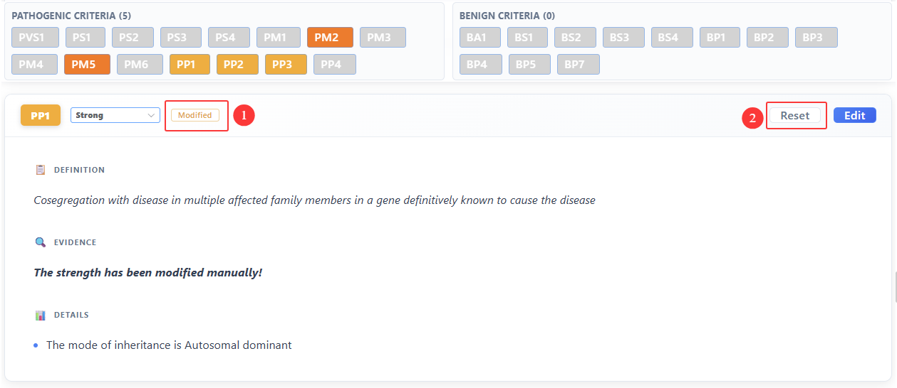

---

## 7. Case Management

<!-- ### ⭐ Key Feature

VARSeeker transforms variant interpretation from a **one-time calculation** into a **continuous, longitudinal process** with automated re-evaluation alerts. -->

!!! success "Key Feature ⭐"

    VARSeeker transforms variant interpretation from a **one-time calculation** into a **continuous, longitudinal process** with automated re-evaluation alerts.

<!-- > ⚠️ **Login Required**: Case management features require user authentication to protect patient privacy and data security. -->

!!! warning "Login Required"

    Case management features require user authentication to protect patient privacy and data security.

### 7.1 Accessing Case Management

1. Click **"My Cases"** in the navigation bar
2. View your case list
3. Click **"View"** to see variants associated with a case

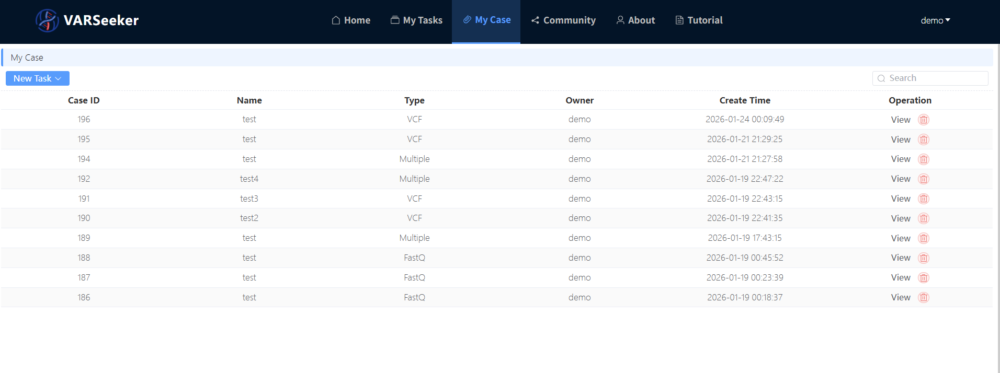
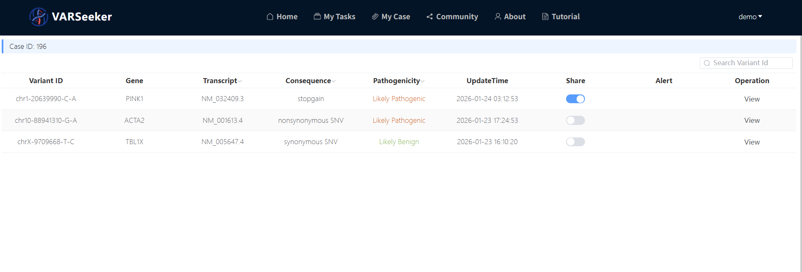

### 7.2 Re-interpretation Alerts

The **Alert column** is VARSeeker's intelligent monitoring system:

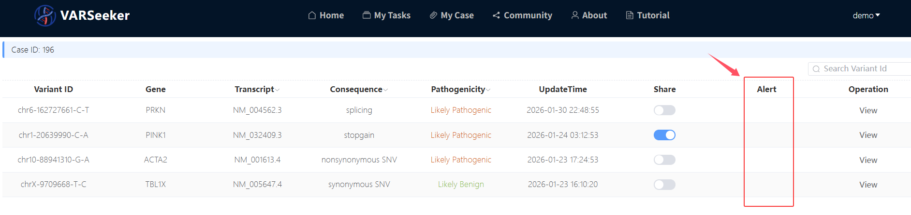

| Alert Status | Meaning | Recommended Action |
|-------------|---------|-------------------|
| 🔔 **Re-interpretation Needed** | Backend database updated or interpretation strategy optimized | Click View, then re-interpret |
| ✅ **No Alert** | Current interpretation is up-to-date | No action needed |

### 7.3 Linking Variants to Cases

1. Open a variant interpretation result page
2. In the Basic Information section, find **"Case ID"**
3. Click the **"Link"** icon to bind or switch the associated case

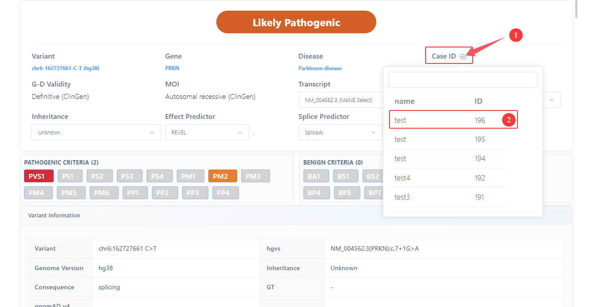

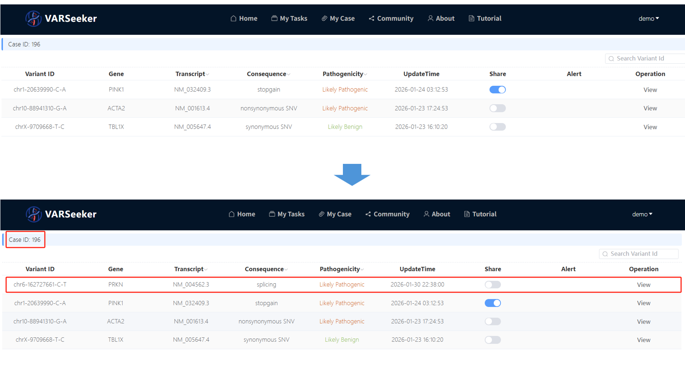

---
## 8. Community Knowledge Sharing

<!-- ### ⭐ Key Feature

VARSeeker's **Community Sharing Library** enables collaborative variant interpretation, fostering transparent knowledge exchange. -->

!!! success "Key Feature ⭐"

    VARSeeker's **Community Sharing Library** enables collaborative variant interpretation, fostering transparent knowledge exchange.

### 8.1 Share Your Interpretation

Sharing is managed through the **My Case** interface to ensure you have full control over what you share.

<!-- > **⚠️ Login Required**: You must be logged in to share interpretations. -->

!!! warning "Login Required"

    You must be logged in to share interpretations.

**Step 1**: Navigate to **My Case** → Select a case → View variant list

**Step 2**: Locate the **"Share"** column in the variant list

**Step 3**: Toggle the **Share** switch to "On" for variants you wish to share publicly

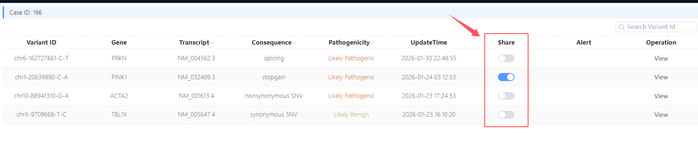

<!-- > **🔒 Privacy Assurance**:
> - Only the variant interpretation is shared, **NOT** any patient/case information
> - A randomly generated anonymous Case ID replaces your actual case identifier
> - You can toggle sharing off at any time to remove from community library -->

!!! info "Privacy Assurance 🔒"

    - Only the variant interpretation is shared, **NOT** any patient/case information
    - A randomly generated anonymous Case ID replaces your actual case identifier
    - You can toggle sharing off at any time to remove from community library

### 8.2 Accessing the Community Library

1. Click **"Community"** in the navigation bar
2. Browse shared variant interpretations
3. Click **"View"** to see detailed shared evidence

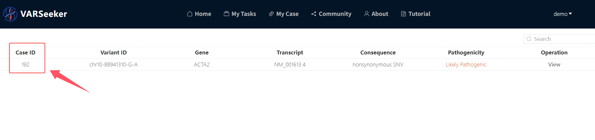

<!-- > 🔒 **Important**: The "Case ID" column displays a **randomly generated identifier** by VARSeeker, used only to distinguish variants. It does **NOT** contain any actual patient case information. -->

!!! info "Privacy Assurance 🔒"

    The "Case ID" column displays a **randomly generated identifier** by VARSeeker, used only to distinguish variants. It does **NOT** contain any actual patient case information.

### 8.3 Viewing Shared Interpretations

Shared interpretation pages display:

- User-curated evidence adjustments
- Modified criteria with rationale
- Community-contributed annotations

---
## 9. Literature-Assisted Interpretation

### Powered by MEDSeeker

VARSeeker integrates with **MEDSeeker** to provide AI-assisted literature analysis.

### 9.1 Accessing Literature Search

1. On the variant interpretation page, click the **"Articles"** tab (upper right of classification banner)

2. Select search keywords:

   - Gene name
   - Transcript ID
   - Variant identifier
   - Amino acid change

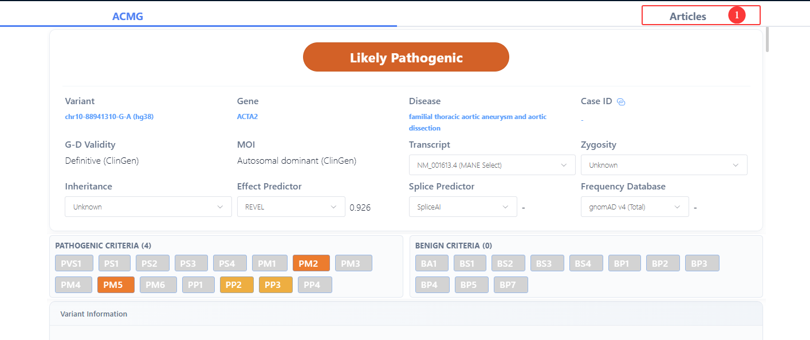

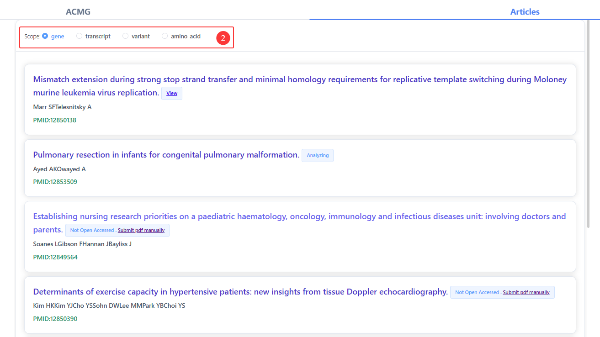

### 9.2 Automated Literature Analysis

| Status                  | Meaning                          | Action                |
| ----------------------- | -------------------------------- | --------------------- |
| **Analyzing**           | System is processing the article | Wait for completion   |
| **View**                | Analysis complete (Open Access)  | Click to view results |
| **Submit pdf manually** | Non-Open Access article          | Upload PDF manually   |

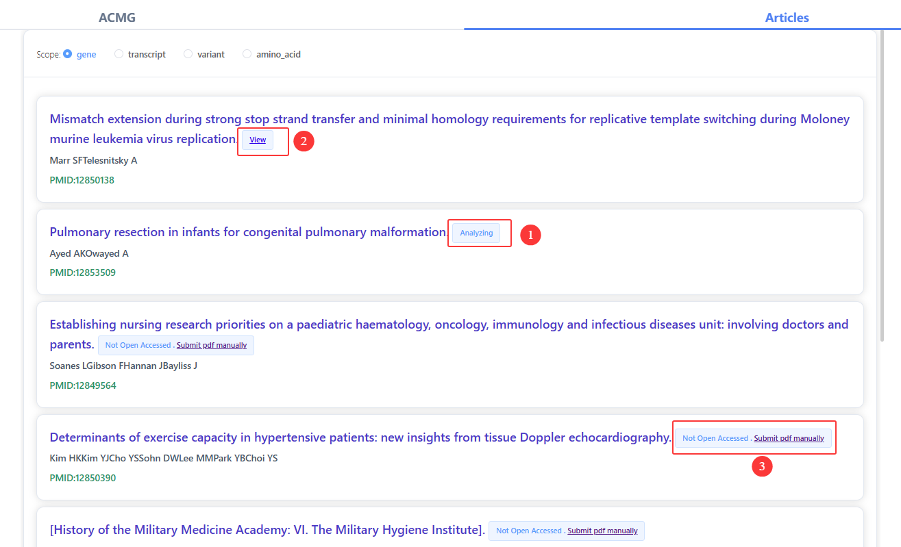

### 9.3 View Literature Analysis Results

Click **"View"** to access analyzed report.

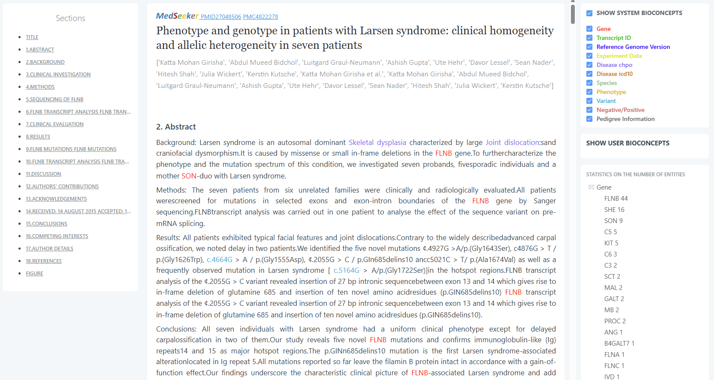

---

## 10. FAQ

### Q1: What genome builds are supported?

**A**: VARSeeker supports both GRCh37/hg19 and GRCh38/hg38 coordinate systems.

### Q2: Do I need an account to use VARSeeker?

**A**: Basic single variant interpretation is available without login. Case management and share your interpretation require registration.

### Q3: What if literature parsing fails?

**A**: Possible reasons:

- Article not open-access → Manually upload PDF
- Article language not English → Currently unsupported
- Network issue → Retry later

### Q4: What does the Alert feature do?

**A**: Alerts notify you when database updates or guideline changes may affect a variant's classification, prompting re-interpretation.

### Q5: Is my patient data secure?

**A**: Yes. Guest users receive unique token URLs. Logged-in users' data is protected by authentication. Shared interpretations use anonymized case IDs.

---

## Need Help?

- 📧 Email: [maoxinxin126@126.com]()
- 📖 Documentation: [https://varseeker-doc.readthedocs.io/en/latest]()
- 🐛 Report Issues: [maoxinxin126@126.com]()

---

*Thank you for using VARSeeker! We're committed to making variant interpretation more precise, efficient, and collaborative.*

